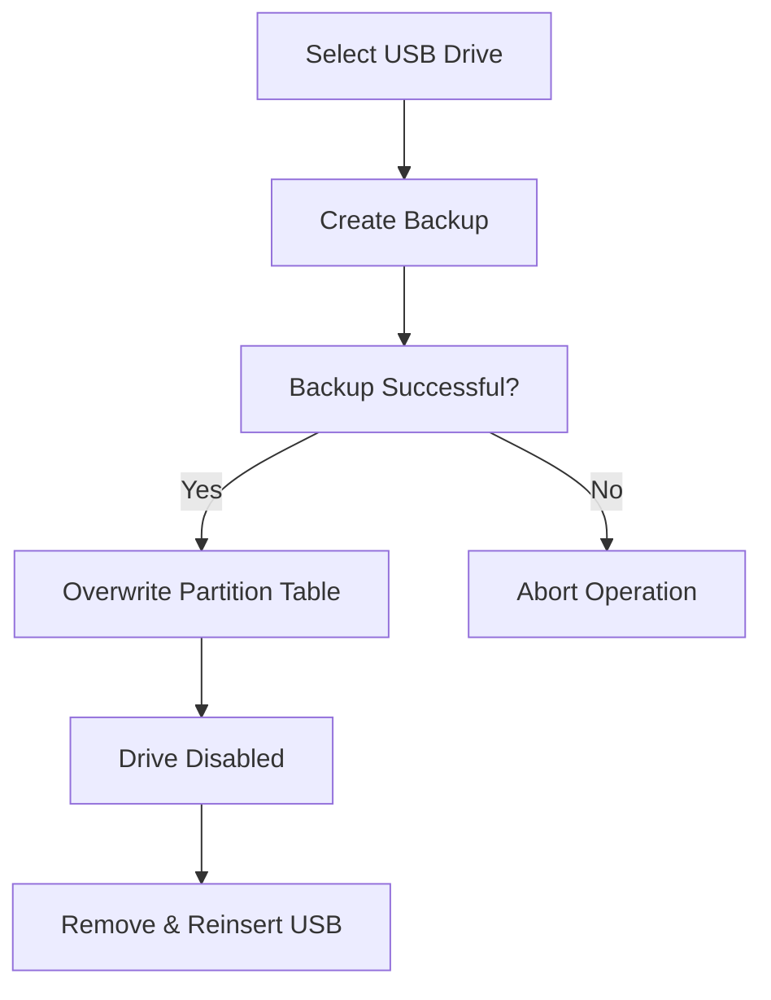
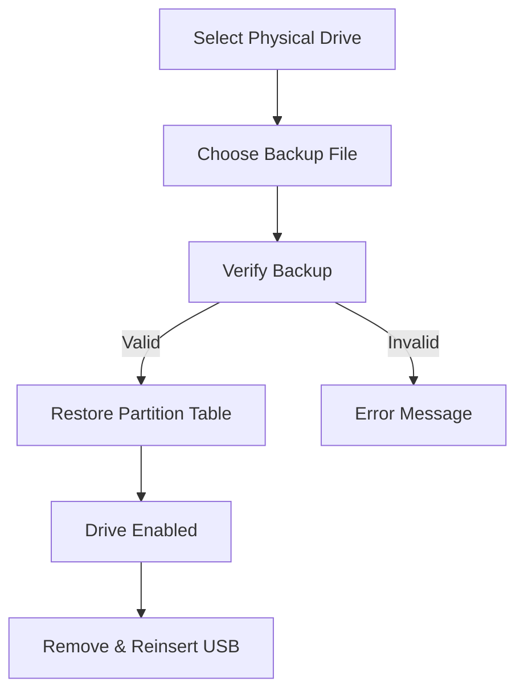

# 🔒 USBLock - Advanced USB Drive Manager

<div align="center">
    

  
  
  
  
  
  **Professional USB Drive Security Management Tool**
  
  *Disable, Enable, and Manage USB drives with enterprise-grade reliability*

</div>

---

## 🌟 Key Features

<table>
<tr>
<td width="50%">

### 🚫 **Drive Disabling**
- Complete USB drive disabling
- Partition table backup before operation
- Data preservation during disable process
- Physical drive-level blocking

</td>
<td width="50%">

### ✅ **Drive Enabling**
- Restore drives from backup files
- Automatic backup management
- Selective backup deletion
- Recovery verification

</td>
</tr>
<tr>
<td>

### 🎨 **Modern Interface**
- Dark theme with modern design
- Real-time drive detection
- Progress indicators
- Intuitive user experience

</td>
<td>

### 🔐 **Security & Logging**
- Administrator privileges required
- Comprehensive operation logging
- Error handling and recovery
- Secure backup file management

</td>
</tr>
</table>

---

## 📥 Download & Installation

### Quick Install (Recommended)

<div align="center">

[](https://github.com/Amirprx3/usblock/releases/latest)

</div>

1. **Download the installer** from the link above
2. **Run USBLock-Setup.exe** as Administrator
3. **Follow the installation wizard**
4. **Launch from Start Menu** or Desktop shortcut

---

## 📋 System Requirements

| Component | Requirement |
|-----------|-------------|
| **OS** | Windows 10/11 (x64) |
| **RAM** | 512 MB minimum |
| **Storage** | 50 MB free space |
| **Privileges** | Administrator rights |
| **Dependencies** | None (all included) |

> ✅ **Self-contained:** No additional software installation required

---

## 🚀 Quick Start Guide

### First Time Setup

1. **Download and install** USBLock from the releases page
2. **Right-click** on USBLock icon → **"Run as administrator"**
3. **Allow UAC prompt** when requested
4. **Connect your USB drive** to the computer

### Basic Operations

#### 🔴 Disabling a USB Drive
```
1. Launch USBLock as Administrator
2. Click "Refresh Drives" to detect USB devices
3. Select the drive you want to disable
4. Click "Disable Selected"
5. Confirm the operation
6. Wait for completion message
7. Remove and reinsert the USB drive
```

#### 🟢 Enabling a USB Drive
```
1. Launch USBLock as Administrator
2. Click "Enable Selected" to switch to enable mode
3. Select the physical drive to restore
4. Choose the backup file from the list
5. Click "Enable Selected" again
6. Confirm the restoration
7. Remove and reinsert the USB drive
```

---

## 🖥️ User Interface

### Main Dashboard
```
┌─────────────────────────────────────────┐
│                USBLock                  │
├─────────────────────────────────────────┤
│  USB Drives List                        │
│ ┌─────────────────────────────────────┐ │
│ │ 1. Drive: E:\ (USB_DRIVE)           │ │
│ │    Size: 32.00 GB, Type: FAT32      │ │
│ │ 2. Drive: F:\ (BACKUP_USB)          │ │
│ │    Size: 64.00 GB, Type: NTFS       │ │
│ └─────────────────────────────────────┘ │
├─────────────────────────────────────────┤
│ [Refresh] [Disable] [Enable] [Help]     │
├─────────────────────────────────────────┤
│ Status: Ready                           │
└─────────────────────────────────────────┘
```

### Operation Modes

#### 🔴 Disable Mode
- Lists all connected USB drives
- Shows drive details (size, label, filesystem)
- Creates automatic backups before disabling

#### 🟢 Enable Mode
- Shows available physical drives
- Lists backup files for recovery
- Option to delete backup after successful restore

---

## ⚙️ How It Works

### Disable Process


### Enable Process

---

## 🛡️ Security Features

### Data Protection
- **Non-destructive disabling:** Original data remains intact
- **Secure backups:** 512-byte partition table backups
- **Verification checks:** Backup integrity validation
- **Error recovery:** Automatic rollback on failures

### Access Control
- **Administrator privileges:** Required for physical drive access
- **Audit logging:** All operations logged with timestamps
- **Safe operations:** Confirmation dialogs for destructive actions

---

## 🔧 Advanced Features

### Backup Management
- **Automatic naming:** `usb_backup_drive{NUMBER}_{TIMESTAMP}.bin`
- **Smart detection:** Automatically matches backups to drives
- **Cleanup options:** Delete backups after successful restore
- **Safe storage:** Backups stored in dedicated folder

### Logging System
- **Detailed logs:** All operations recorded in `usblock.log`
- **Error tracking:** Failed operations logged with error details
- **Timestamp records:** Precise timing of all operations

---

## 🚨 Important Warnings

> ⚠️ **Always run as Administrator** - The application requires elevated privileges to access physical drives.

> ⚠️ **Remove and reinsert USB** - After any operation, safely remove and reinsert the USB drive.

> ⚠️ **Keep backups safe** - Store backup files securely; they're required to restore disabled drives.

> ⚠️ **Windows only** - This tool is designed specifically for Windows systems.

---

## 🐛 Troubleshooting

### Common Issues

| Issue | Solution |
|-------|----------|
| "Access Denied" error | Right-click → "Run as administrator" |
| Drive not detected | Click "Refresh Drives" button |
| Application won't start | Check Windows compatibility mode |
| Backup creation failed | Ensure sufficient disk space |
| Enable operation failed | Verify backup file integrity |

### Error Messages

| Error | Meaning | Solution |
|-------|---------|----------|
| `Admin privileges required` | Not running as administrator | Run as administrator |
| `No USB drives found` | No removable drives detected | Connect USB drive and refresh |
| `Backup failed` | Cannot create backup file | Check disk space and permissions |
| `Invalid backup file` | Corrupted or wrong backup | Use correct 512-byte backup file |

### Log Files
Application logs are stored in:
- **Installed version:** `C:\Program Files\USBLock\usblock.log`
- **Portable version:** `USBLock-Portable\usblock.log`

---

## 🔄 Updates & Maintenance

### Automatic Updates
- **Check for updates:** Built-in update checker
- **Download notifications:** Alerts when new version available
- **Easy upgrade:** One-click update process

### Manual Updates
1. Download latest version from releases page
2. Run new installer (will upgrade existing installation)
3. Your settings and backups are preserved

---

## 📜 License

This project is licensed under the MIT License - see the [LICENSE](LICENSE) file for details.

```
MIT License - Copyright (c) 2024 USBLock Project
Permission is hereby granted, free of charge, to any person obtaining a copy
of this software and associated documentation files...
```

---

## 👨‍💻 Development By
### Amirprx3

---

<div align="center">

**⭐ Star this repository if you find it helpful!**

[](https://github.com/Amirprx3/usblock/stargazers)
[](https://github.com/Amirprx3/usblock/network/members)

---

*Made with ❤️ for the security community*

**[Download Latest Release](https://github.com/Amirprx3/usblock/releases/latest) | [View Documentation](https://github.com/Amirprx3/usblock/wiki) | [Report Issues](https://github.com/Amirprx3/usblock/issues)**

</div>
